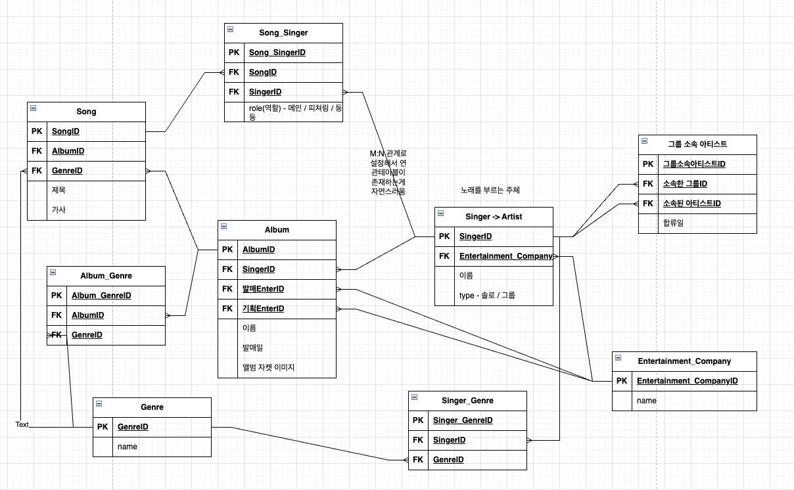

# 💭 2026-01-28 (Wed) TIL

## 🌱 Todo

- ✔️ ~~새싹(SeSAC) 상담 이력서 제출~~

- ✔️ ~~새싹(SeSAC) 강의 진도 따라가기~~
  - ERD 설계

...

## 🎧 간단 정리

### 1. 엔티티 통합과 다형성 (Artist 모델)
>**문제**: 
* 가수와 그룹 테이블을 분리하면, 노래(Song) 테이블에서 누가 불렀는지 참조할 때 한쪽이 항상 NULL이 되는 '**배타적 관계**' 문제가 발생
>**해결**: 
* `Singer`와 `Group`을 `Artist`라는 하나의 테이블로 통합하고 `type` 컬럼(솔로/그룹)으로 구분
> **재귀적 관계**: 
* `그룹 소속 아티스트`라는 연관 테이블을 만들어 Artist가 자기 자신(그룹-멤버)을 참조하게 설계

---

### 2. 다대다(N:M) 관계의 심화 (도서관 플랫폼)

> **도서관-책(Library-Book)**:
* 단순히 '책' 테이블에 개수를 두지 않고, 연관 테이블에 `보유개수(count)`를 두어 **지점별 재고**를 관리합니다.

>**책-대출(Book-Lending)**:
* 한 번의 대출 행위에 여러 권의 책이 포함될 수 있으므로 상위 테이블(`대출`)과 상세 테이블(`책-대출`)로 분리합니다.

---

### 3. 데이터 중복 제거 및 역할 분담 (Lending vs Book-Lending)

가장 헷갈리기 쉬운 '트랜잭션'과 '상세 내역'의 구분

| 구분 | 대출 (Lending) | 책-대출 (Book-Lending) |
| --- | --- | --- |
| **개념** | 대출이라는 **행위** (주문서) | 빌려간 **개별 책** (주문 항목) |
| **포함 데이터** | 대출 일자, 사용자 ID | 반납 예정일, 실제 반납일, 상태(연체 등) |
| **장점** | 데이터 일관성 유지 (수정 용이) | 책마다 다른 반납 상태를 개별 관리 가능 |

 

## 핵심 인사이트

* **추상화**: 공통점이 있는 엔티티(솔로/그룹)는 하나로 합치되 구분 값을 두는 것이 관리에 효율적이다.
* **정규화**: 공통된 정보(대출일)는 상위 테이블에, 개별적인 정보(반납일)는 상세 테이블에 두어 데이터 중복을 막아야 한다.
* **확장성**: 플랫폼 설계 시 '어디에 있는(Library)' 데이터인지 식별하는 외래키(FK) 배치가 중요하다.

...

## 🐚 회고
**내일부터는 코테 3문제 풀기**

**모자 쓰지말고 마스크 쓰지말기**