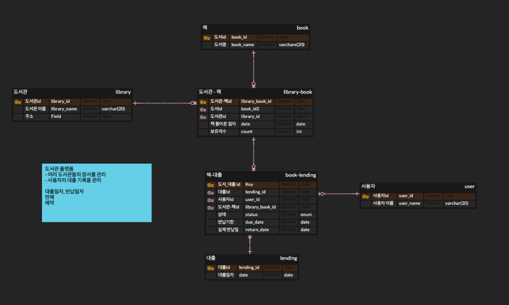
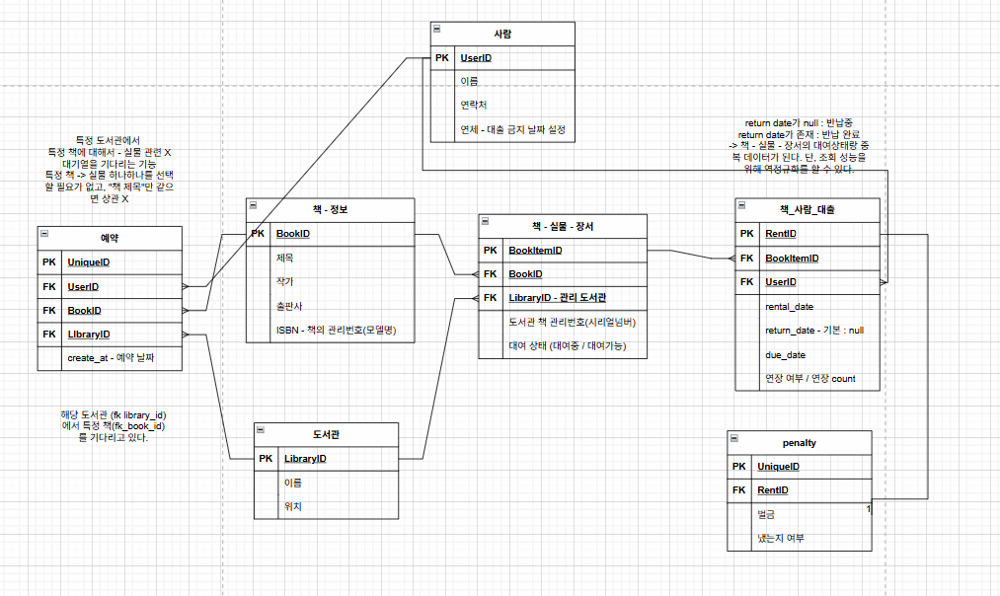
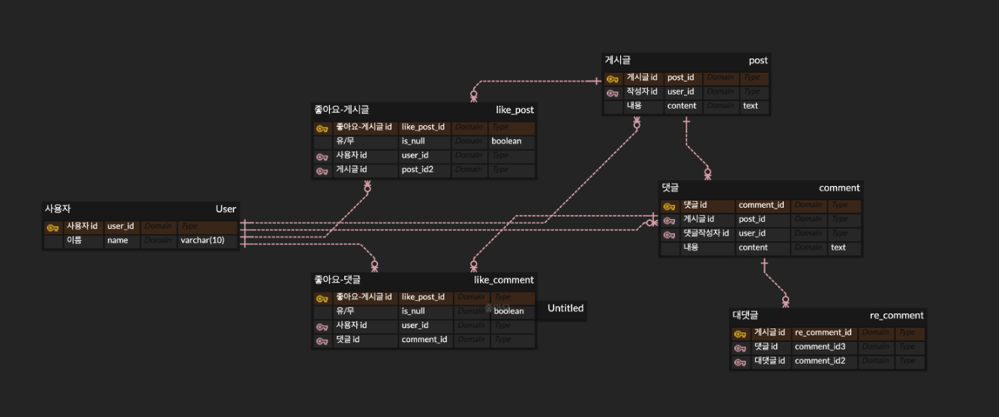
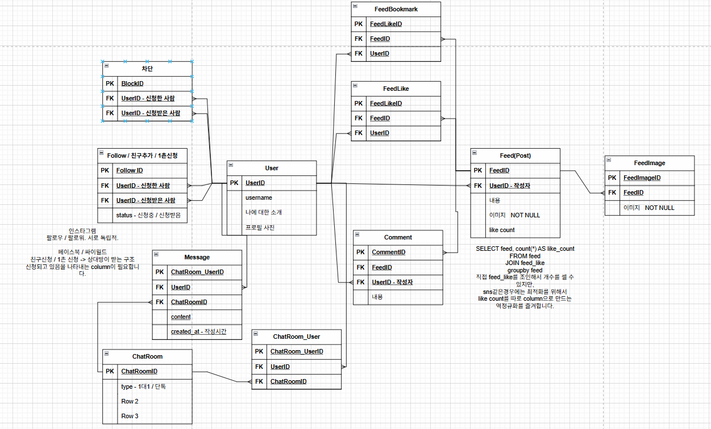

# 💭 2026-01-29 (Thu) TIL

## 🌱 Todo

### 코테 준비
- ✔️ ~~**solved.ac class 3** 3문제~~
  - ☑️ 2805, 14495, 1463(1만들기)
  - ✍️ 1654
      

- ✔️ ~~새싹(SeSAC) 강의 진도 따라가기~~
  - instagram ERD

...

## 🎧 간단 정리

### 알고리즘 문제

**2805 나무 자르기 – 개념 요약**
> 1️⃣ 문제 핵심
- **톱날 높이 H**를 정하는 문제
- 목표: 잘린 나무 길이 **합 ≥ M**
- 정답: 조건을 만족하는 **H 중 최댓값**

> 2️⃣ 왜 이분 탐색인가
- H가 커질수록 얻는 나무 길이는 단조 감소
- `0 ~ max(tree)` 범위에서 탐색 가능

> 3️⃣ 판별 함수 (check)
- `H`가 주어졌을 때
- `sum(max(0, tree - H)) >= M ?`
- True → 가능
- False → 불가능

> 4️⃣ 탐색 규칙
- 가능(`>= M`)
- 정답 후보로 저장
- H를 더 크게 (start = mid + 1)
- 불가능(`< M`)
- H를 낮춤 (end = mid - 1)

> 5️⃣ 종료 조건
- `start > end `
- 정답은 탐색 중에 이미 저장됨

> 6️⃣ 주의사항
- ❌ `== M`만 찾으려 함
- ❌ 평균, 나누기, 시뮬레이션
- ❌ 종료 조건에서 답을 찾으려 함

<br>

```
“가능하면 올리고, 불가능하면 내린다”
```

### Dp
초기값 인덱스 범위 설정 유의

### ERD
#### 도서관 ERD




### instagram ERD




...

## 🐚 회고
**쉬는시간 제대로 쉬고 공부할때 제대로 하기**