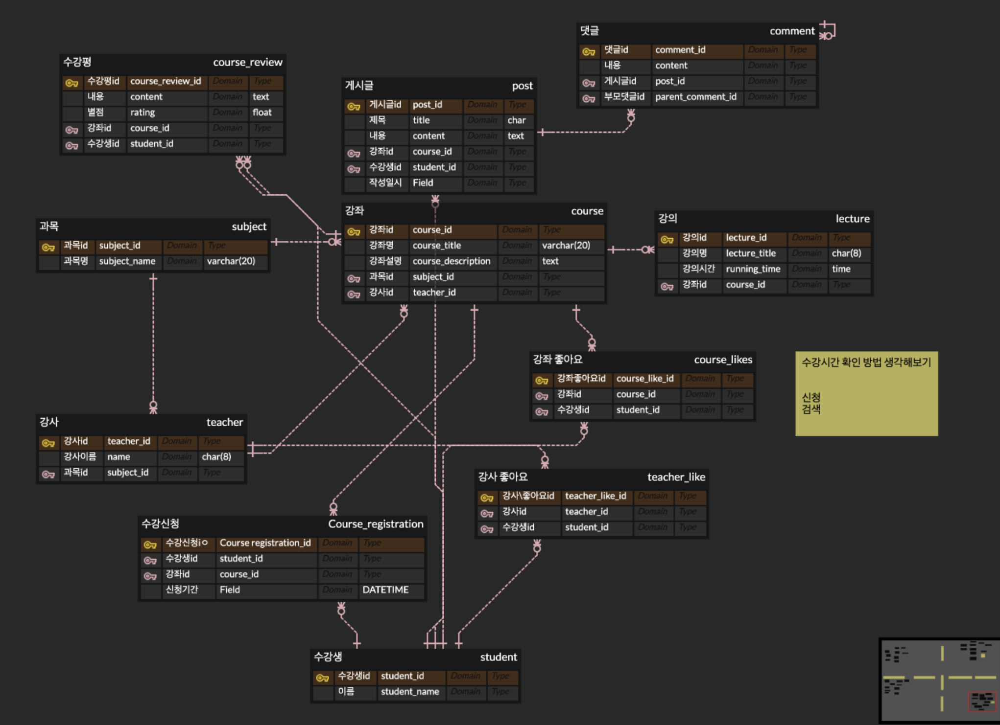

# 💭 2026-01-DD (Tue) TIL

## 🌱 Todo

- ✔️ ~~새싹(SeSAC) 강의 진도 따라가기~~

### 코테 준비
- □ **solved.ac class 3** 3문제 
  - ☑️ 
  - ✍️ 1654, 11652, 1874(수열)

...

## 🎧 간단 정리

### course_erd

...

## 🐚 회고
**신청방법, 대댓글 연결 방식에 대해 알게 되었다..!    수업시간에 팀플을 해서 백준 문제 풀시간은 없었지만 토요일에 일어나서 추가적으로 풀어보자**