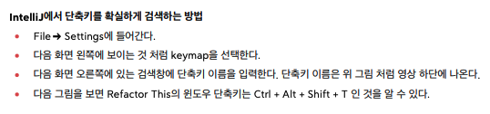

# 01. Environment Setup & Basics

> **Date:** 2026-03-04  
> **Goal:** Spring Boot 개발 환경 구축 및 IntelliJ 숙련도 향상

---

## 1. Spring Boot Project Initialization
새로운 프로젝트를 시작할 때의 표준 설정 (start.spring.io)

* **Project:** Gradle - Groovy (또는 Maven)
* **Language:** Java
* **Spring Boot:** 4.0.3 (최신 안정 버전)
* **Packaging:** Jar
* **Java Version:** 21 (LTS 버전 권장)

### 📦 핵심 Dependencies (초기 설정 필수)
- **Spring Web:** RESTful API 구축용
- **Thymeleaf:** HTML 템플릿 엔진. 컨트롤러가 전달한 데이터를 화면에 동적으로 렌더링할 때 사용 (View 담당)
---

## 2. IntelliJ Productivity Shortcuts
단축키 (Mac 기준)

| 단축키 | 기능 | 설명 |
| :--- | :--- | :--- |
| `Cmd + Shift + Enter` | **Smart Complete** | 문장을 완성하고 자동으로 세미콜론(`;`) 삽입 및 줄바꿈 |
| `Opt + Enter` | **Show Context Actions** | 에러 해결 제안, 인터페이스 구현(오버라이드) 등 액션 가이드 |
| `Cmd + Opt + V` | **Introduce Variable** | 리턴값에 맞는 변수 타입을 자동으로 선언 및 생성 |
| `Cmd + Shift + T` | **Create Test** | 현재 클래스에 대한 JUnit 테스트 케이스 자동 생성 |
| `Cmd + Opt + L` | **Reformat Code** | 코드 정렬 및 포맷팅 (Clean Code의 기본) |
| `Cmd + Opt + B` | **Move** | implements로 이동|
| `Opt + Enter` | **lambda** | 람다식으로 변경|
| `ctrl + t` | **search** | 'inline' 검색 후 사용|

---
## 3. 핵심 개념
- **View Resolver:** 컨트롤러가 리턴한 문자열(예: `"hello"`)을 받아 `resources/templates/hello.html`을 찾아가는 구조.
- **Static Content:** `resources/static`에 넣으면 정적 파일 그대로 서빙됨.

## 4. Spring vs Python (My Philosophy) 💡
면접에서 "왜 스프링인가?"를 묻는다면 답변할 핵심 논리

* **Type Safety:** 컴파일 단계에서 에러를 잡아내는 Java의 강력한 타입 시스템.
* **Architecture:** 계층 구조(Layered Architecture)를 강제하여 대규모 협업에 유리.
* **Scalability:** 엔터프라이즈 급 시스템 확장에 검증된 수많은 레퍼런스(Spring Security, Batch 등).

