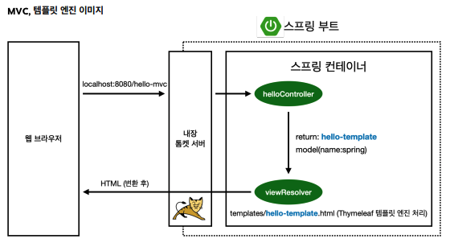
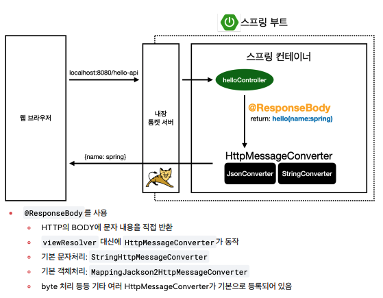

# 02. Spring Web & Backend Basics 🏗️

> **Date:** 2026-03-04  
> **Topic:** 스프링 웹 개발 방식 및 회원 관리 예제 백엔드 설계

---

## 1. 스프링 웹 개발 방식 (3가지)

강의에서 다룬 웹 브라우저와 스프링 부트의 상호작용 방식.

| 방식 | 특징 | 동작 원리 |
| :--- | :--- | :--- |
| **정적 컨텐츠** | 파일을 그대로 고객에게 전달 | `resources/static`에서 파일을 찾아 반환 |
| **MVC와 템플릿 엔진** | 서버에서 HTML을 동적으로 변형 | `Controller`의 리턴 문자열을 `viewResolver`가 HTML로 변환 |
| **API** | 데이터를 직접 전달 (JSON) | `@ResponseBody` 사용 시 `HttpMessageConverter`가 객체를 JSON으로 변환 |

> **💡 핵심:** 최근 트렌드인 프론트엔드(React, Vue)와 백엔드 분리 구조에서는 **API 방식**이 주로 사용.

 

#### @ResponseBody 사용 원리

---

## 2. 일반적인 웹 애플리케이션 계층 구조
대규모 시스템 설계 시 표준이 되는 5가지 계층.

1.  **컨트롤러 (Controller):** 웹 MVC의 컨트롤러 역할. API 엔드포인트를 노출하고 요청을 수신합니다.
2.  **서비스 (Service):** 핵심 비즈니스 로직 구현. (예: "이름이 중복된 회원은 가입 불가")
3.  **리포지토리 (Repository):** 데이터베이스에 접근하여 도메인 객체를 저장하고 관리합니다.
4.  **도메인 (Domain):** 회원, 주문, 쿠폰 등 비즈니스 도메인 객체 (주로 DB에 저장되는 엔티티).
5.  **DB:** 실제 데이터가 저장되는 물리적 공간.

---

## 3. 회원 관리 예제 설계 (백엔드)

### 유연한 설계 (Interface 활용)
* 아직 데이터 저장소가 선정되지 않은 가상의 시나리오를 가정합니다.
* `MemberRepository`를 **인터페이스**로 설계하여, 나중에 메모리 DB에서 실제 RDB(MySQL 등)로 교체하기 쉽게 만듭니다.

### DI (Dependency Injection, 의존성 주입)
* 서비스가 리포지토리를 직접 생성(`new`)하지 않고, **생성자를 통해 외부에서 주입**받도록 설계.
* **이유:** 테스트 시 동일한 리포지토리 인스턴스를 공유하여 데이터 정합성을 맞춤.

---

## 4. 테스트 케이스 작성 (JUnit 5)

테스트 코드는 필수.

* **`@AfterEach`**: 각 테스트가 끝날 때마다 호출. 테스트 간 의존 관계를 없애기 위해 **메모리 저장소를 초기화(`clearStore`)**하는 용도로 사용.
* **`@BeforeEach`**: 테스트 실행 전 호출되어 항상 새로운 객체를 생성하고 의존관계를 맺어줌.
* **Given / When / Then 패턴**: 테스트 코드를 구조화하는 가장 권장되는 방식.

---

## 🛠️ 실무 활용 팁

### IntelliJ 환경 설정 최적화
* **Build 속도 향상:** `Settings` -> `Build, Execution, Deployment` -> `Build Tools` -> `Gradle`에서 `Build and run using`을 **IntelliJ IDEA**로 변경. (Gradle을 거치지 않아 실행이 훨씬 빠름.)

### 동시성 고려
* 실무 환경(멀티스레드)에서는 단순한 `HashMap`이나 `long` 보다는 **`ConcurrentHashMap`**과 **`AtomicLong`**을 사용하는 것이 안전.